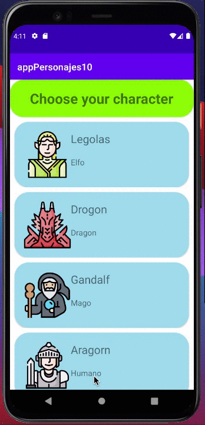

#A short exercise for the basics of Android and Kotlin. Characters (2021)
## By Belen Cerezo

An android application using Kotlin Language. This app shows characters from The Lord of the Rings.

## Requirements
* Android Studio ([https://developer.android.com/studio/](https://developer.android.com/studio/))
* Kotlin

## Preview

### Autor
*Belen Cerezo. © 2021*
